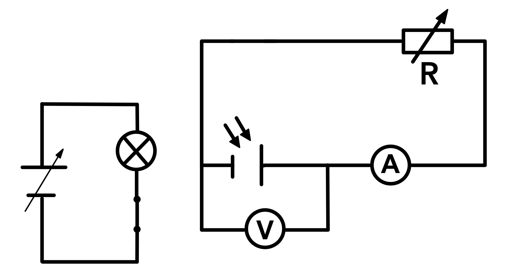

# U-I-Kennlinie einer Solarzelle

**Antwort 1**

  <form name="Eingabe">
    <input name="button1" value="noch 10 Sekunden" disabled="disabled" onClick="location.href='hilfe2.html';" type="button">
  </form>

